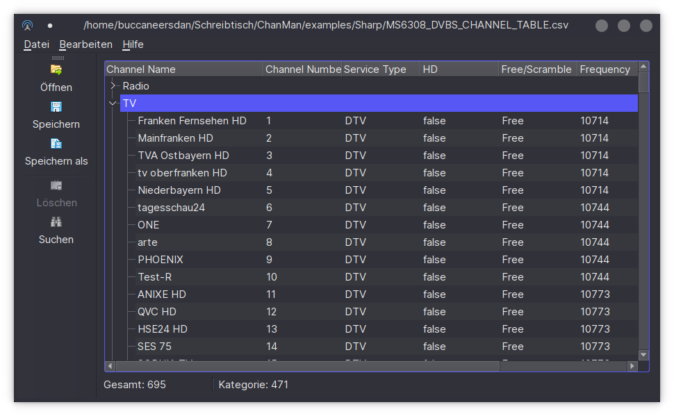
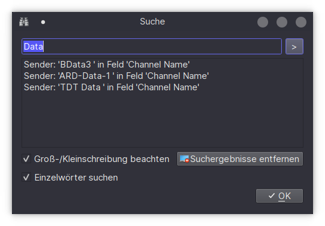
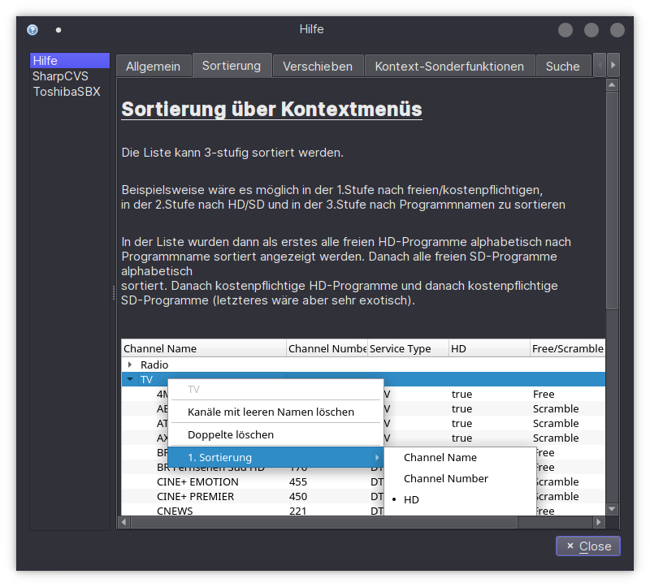
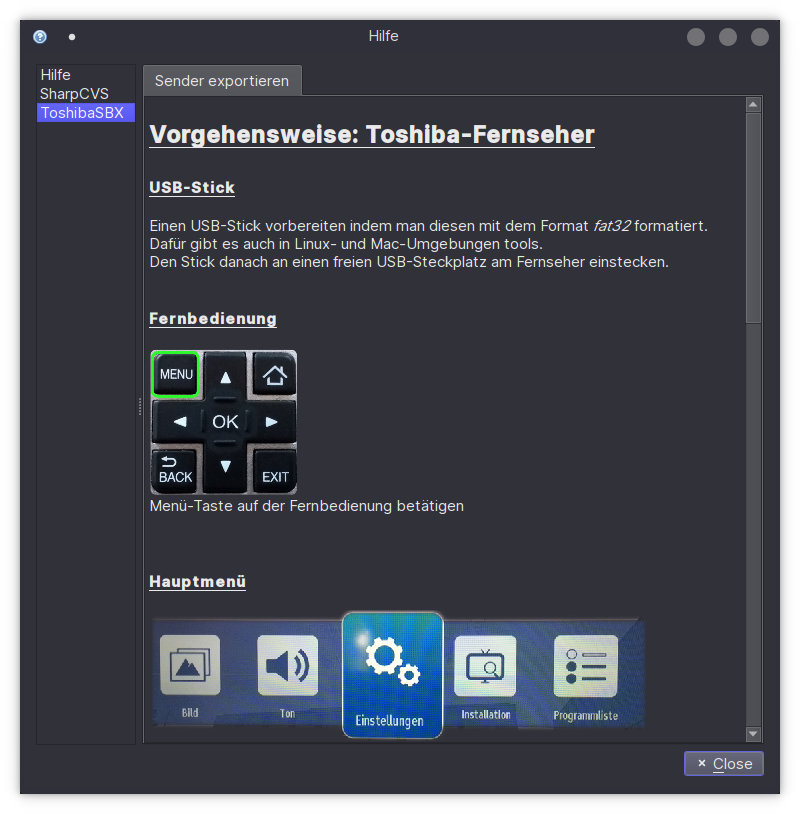

### ChanMan

<i>[🡕 Anleitung zum Starten oder Kompilieren der Applikation](https://jackleemmerdeur.github.io/ChanMan/)</i>

#### Anwendungsgebiet der Applikation

Ermöglicht die Sortierung und das Entfernen unerwünschter TV- und Radio-Sender verschiedener TV-Geräte auf denen die Verwaltung derselben über die Fernbedienung ansonsten zu umständlich wäre.

Es können über ein Plug-In System mit entsprechender Vorkenntnis der Programmiersprache Python, TV-Sender-Datenformate weiterer TV-Geräte hinzugefügt werden.

Momentan unterstütze Geräte:
```
Sharp LC-49CFE6242
Toshiba (diverse Modelle)
```
#### Funktionen


<sup>&nbsp;&nbsp;&nbsp;&nbsp;&nbsp;Alle Aktionen finden in der Sender-Liste der Hauptansicht statt</sup>

In der Senderliste können Sender als Einzel- oder Multiple-Auswahl gelöscht oder via Drag n' Drop verschoben werden, sowie die Sender-Namen verändert werden.

Über ein Kontextmenu kann in dieser Liste sortiert werden nach:  
* HD/SD Format
* Freien oder verschlüsselten Kanälen
* Sender-Namen

Außerdem enthält das Kontext-Menu Funktionen um automatisch alle Sender mit leeren Namen sowie doppelte vorhandene Sender zu entfernen.

#### Suche

Mittels des Suche-Dialogs können schnell meherere Sender einer Sender-Gruppe (z.B. ZDF oder WDR) markiert oder gelöscht werden.



#### Hilfe

Die integrierte Hilfe zeigt eine genaue Anleitung der Applikation, sowie die Anleitungen zum Import und Export der Senderlisten der verfügbaren TV-Geräte.




